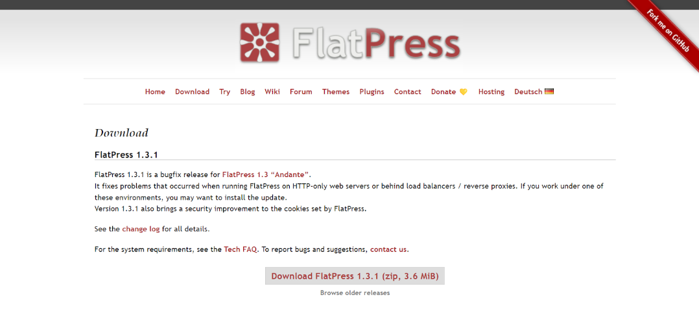
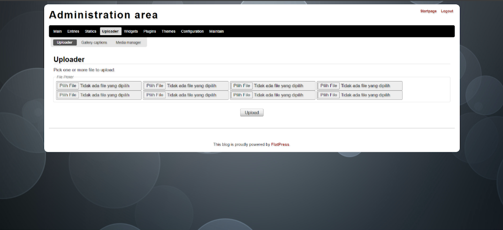

# Sekilas Tentang
FlatPress adalah sistem manajemen konten (CMS) blog gratis berbasis file yang ringan dan sederhana, hanya menggunakan PHP tanpa memerlukan database. Diluncurkan sejak 2006, FlatPress telah teruji dengan baik dan menawarkan kemudahan dalam pengaturan, pencadangan, dan penyesuaian dengan dukungan tema berbasis Smarty disertai sistem plugin.

# Instalasi
## Kebutuhan Sistem

- A web server that supports PHP 7.1–8.3
- The PHP intl extension
- A rewrite engine (mod_rewrite) untuk PrettyURLs plugin
- GDlib untuk membuat image thumbnails

## Proses instalasi : 
1. Kunjungi github FlatPress lalu cari link untuk download

2. Download file zip yang disediakan di website resmi FlatPress

3. Kunjungi rumahweb dan beli paket hosting serta domain

4. Login panel dan masukkan file zip serta extract di folder public_html

5. Buat database untuk website yang akan di hosting

6. Buat user dan pastikan seluruh privileged dimiliki oleh user tersebut, jadikan admin dari database yang sudah dibuat sebelumnya

7. Kunjungi domain yang telah dibuat dan ikuti langkah setup pada FlatPress

8. FlatPress sudah dapat diakses menggunakan domain yang sudah dibuat

# Konfigurasi
- Admin dapat melakukan konfigurasi dalam lingkup general (admin, blog, dan website)

- Admin dapat melakukan konfigurasi dalam lingkup internasional (waktu, bahasa, dan karakter)

- Admin dapat melakukan konfigurasi widgets atau susunan tampilan website

- Admin dapat melakukan konfigurasi plugin untuk mendukung penggunaan FlatPress

- Admin dapat melakukan konfigurasi tema pada tampilan utama FlatPress

# Maintenance
- Admin dapat membangun ulang index website

- Admin dapat membersihkan cache template dan tema

- Admin dapat melakukan restore pada file permissions

- Admin dapat mengecek informasi terkait PHP yang digunakan untuk memastikan apabila terjadi kesalahan teknis maupun hal lainnya

- Admin dapat melakukan update pada website dan meluncurkan pengumuman bahwasanya telah dilakukan update pada website

# Cara Pemakaian
- Setelah menuju alamat web, kita akan melihat tampilan halaman utama yang memuat informasi mengenai postingan blog yang tersedia 

- Kita juga dapat melihat komentar-komentar yang ditinggalkan pengguna lain, atau menambahkan komentar baru sebagai user

- Login untuk admin

- Setelah melakukan login admin, kita akan masuk ke halaman utama Admin Area. Di sini kita dapat mengelola/menggunakan berbagai fitur yang tersedia

- Berikut adalah halaman “Entries” admin, admin dapat melihat dan mengedit postingan-postingan blog yang sudah diunggah

- Admin dapat mengunggah postingan ke dalam blog untuk ditampilkan kepada publik

- Berikut adalah tampilan halaman “Uploader”, di sini admin dapat mengunggah beberapa file (seperti png atau pdf) untuk disimpan ke dalam Media Manager (tidak ditampilkan secara publik)

- Tampilan Media Manager

- Berikut adalah tampilan utama website blog sebagai admin, kita dapat melakukan edit/delete pada postingan secara langsung

- Admin juga dapat menambahkan komentar untuk postingan

- Selain menu-menu yang berhubungan dengan fungsi utama website sebagai media blogging, FlatPress juga menyediakan menu untuk meningkatkan performa website, seperti menu untuk mengelola widgets, menu untuk mengelola plugin, menu untuk mengubah tampilan/tema website, serta menu untuk melakukan konfigurasi website

# Pembahasan
FlatPress merupakan platform blogging berbasis flat-file yang memiliki beberapa kelebihan dan kekurangan. Kelebihannya meliputi kesederhanaan instalasi, hanya membutuhkan satu langkah, serta penggunaan BBCode yang memudahkan penulisan markup di atas HTML mentah. Desain tema bawaannya cukup modern dan responsif untuk perangkat seluler. Selain itu, fitur unggahan gambar lengkap dengan galeri dan lightbox sehingga membuat pengelolaan media visual menjadi mudah. Terdapat plugin seperti captcha dan Akismet untuk moderasi komentar. Dokumentasinya pun cukup baik untuk pengguna maupun pengembang, serta dukungan komunitas yang aktif. Kecepatan aplikasi dan kompatibilitasnya dengan PHP 5.6 hingga 7.4 pada berbagai server web juga menjadi nilai tambah.

Namun, kekurangan FlatPress terletak pada keamanan yang agak longgar menurut standar modern, seperti perlunya membatasi akses manual ke folder tertentu, serta keterbatasan dalam pengelolaan username dan password dari panel kontrol. Sistem penambahan fitur seperti tag yang hanya bisa diakses melalui plugin tambahan juga bisa dianggap sebagai kekurangan dibandingkan dengan platform serupa.

Jika dibandingkan dengan platform flat-file lain seperti Grav atau PicoCMS, FlatPress lebih sederhana dalam hal fitur dan fleksibilitas. Sedangkan Grav menawarkan lebih banyak kemampuan kustomisasi dan tema yang lebih variatif, serta memiliki keamanan yang lebih baik. Selain itu, PicoCMS juga lebih ringan dan bahkan lebih sederhana, tetapi mungkin kurang intuitif bagi pengguna yang baru mengenal flat-file CMS. FlatPress unggul dalam kemudahan penggunaan dan dukungan komunitas, tetapi bisa dianggap kurang lengkap bagi pengguna yang mencari fitur canggih dan keamanan yang lebih kuat.

# Referensi
- https://www.flatpress.org/
- https://wiki.flatpress.org/doc:techfaq#what_is_required_to_run_flatpress
- https://felix.plesoianu.ro/blog/flatpress-review.html
- https://picocms.org/about/
- https://getgrav.org/about
